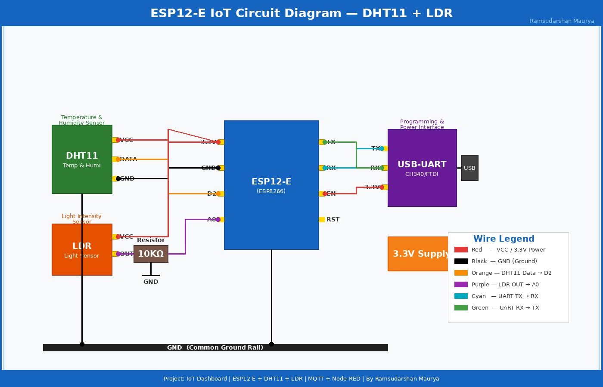
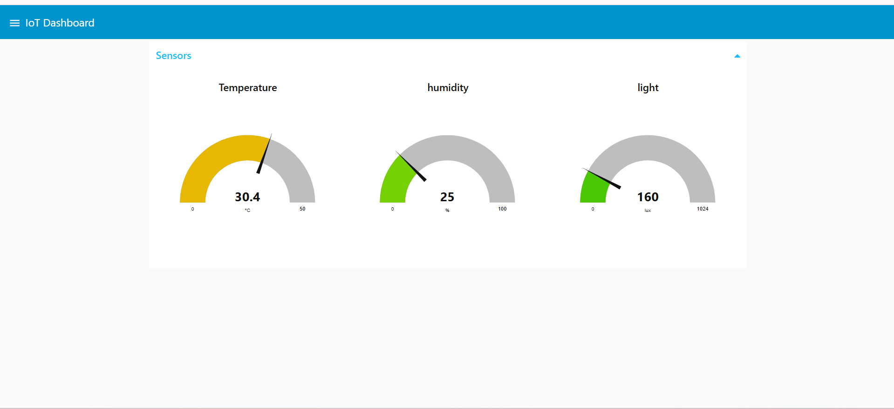
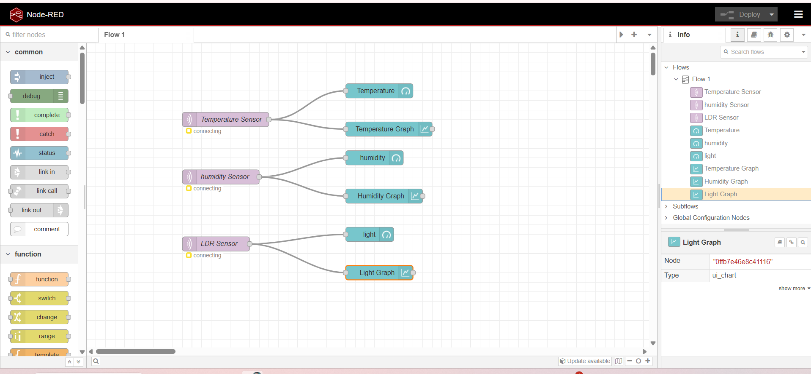
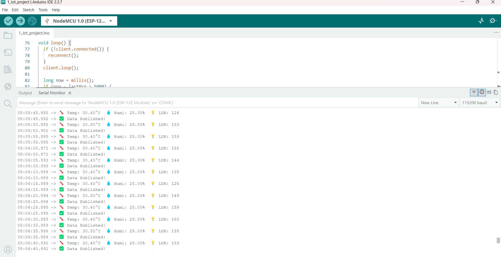
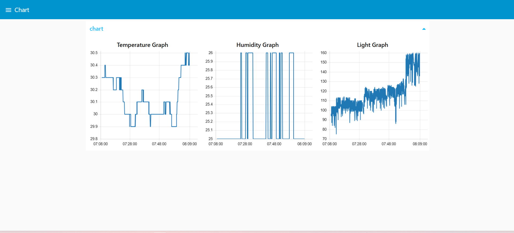

# ⚡ NodeMCU8266 / ESP12-E IoT Projects

**WiFi-based IoT Projects using ESP8266 / ESP12-E**
Real Hardware | MQTT | Node-RED Dashboard | Live Monitoring

---

## 🛠️ Technologies Used

---

## 📁 All Projects

| # | Project Name | Description | Sensors | Status |
|---|-------------|-------------|---------|--------|
| 1 | [IoT Dashboard - DHT11 + LDR](1_IoT_Project_DHT11_LDR_Dashboard/README.md) | Real-time Temperature, Humidity & Light monitoring with Node-RED Dashboard | DHT11, LDR | ✅ Done |
| 2 | [IoT Dashboard - DHT11 + LDR + MQ135 + Ultrasonic + OLED](2_IoT_Project_DHT11_LDR_MQ135_Ultrasonic_OLED/README.md) | Advanced monitoring with Air Quality, Distance, OLED Display & LED Control | DHT11, LDR, MQ135, HC-SR04, OLED | ✅ Done |
| 3 | Coming Soon... | Next IoT Project | - | 🔄 |

---

## 🔥 Project 1 — IoT Dashboard - DHT11 + LDR + Node-RED

> Real-time IoT monitoring system using **ESP12-E (ESP8266)** with **DHT11** and **LDR** sensors.
> Data published via **MQTT** to **HiveMQ** broker and visualized on **Node-RED Dashboard** with live Gauges and Charts.

| Hardware | Protocol | Platform | Dashboard |
|:---:|:---:|:---:|:---:|
| ESP12-E + DHT11 + LDR | MQTT / HiveMQ | Node-RED | Gauges + Charts |

### 🖼️ Preview

| | | |
|:---:|:---:|:---:|
|  |  |  |
| Circuit Diagram | Dashboard View | Node-RED Flow |
|  |  | |
| Serial Monitor | Gauge View | |

📄 [View Full Project →](1_IoT_Project_DHT11_LDR_Dashboard/README.md)

---

## 🔥 Project 2 — IoT Dashboard - DHT11 + LDR + MQ135 + Ultrasonic + OLED + LED Control

> Advanced IoT monitoring system using **ESP12-E (ESP8266)** with **DHT11**, **LDR**, **MQ135**, **HC-SR04 Ultrasonic** sensors and **SSD1306 OLED Display**.
> OLED shows real-time sensor data and **"!! ALERT !!"** when object detected within **15cm**.
> **LED1** auto-triggers at 15cm. **LED2** controlled via **Node-RED Dashboard Switch**.

| Hardware | Protocol | Platform | Dashboard |
|:---:|:---:|:---:|:---:|
| ESP12-E + DHT11 + LDR + MQ135 + HC-SR04 + OLED | MQTT / HiveMQ | Node-RED | Gauges + Charts + Switch |

### 🖼️ Preview

| | | |
|:---:|:---:|:---:|
|  |  |  |
| Circuit Diagram | Dashboard View | Node-RED Flow |
|  |  |  |
| Serial Monitor | OLED Display | Chart View |

📄 [View Full Project →](2_IoT_Project_DHT11_LDR_MQ135_Ultrasonic_OLED/README.md)

---

### 🔗 Connect With Me

**⭐ Star this repo if you found it helpful!**

---

## 👤 About Me

| | |
|---|---|
| 👨‍💻 **Name** | Ramsudarshan Maurya |
| 🏢 **Company** | UniConverge Technologies |
| 📍 **Location** | Noida Sector 62 |
| 📧 **Email** | [ramsudarshanmaurya@gmail.com](mailto:ramsudarshanmaurya@gmail.com) |
| 💼 **LinkedIn** | [in/ramsudarshanmaurya](https://linkedin.com/in/ramsudarshanmaurya) |
| 🌐 **Portfolio** | [ramsudarshanmaurya.engineer](https://ramsudarshanmaurya.engineer) |
| 🐙 **GitHub** | [Ramsudarshanmaurya](https://github.com/Ramsudarshanmaurya) |
| 📁 **Drive** | [Project Files](https://drive.google.com/drive/folders/1SslKdhRWbyK213nZJpzLBBzx7PcJapPm?usp=sharing) |

---

Made with ❤️ by Ramsudarshan Maurya

